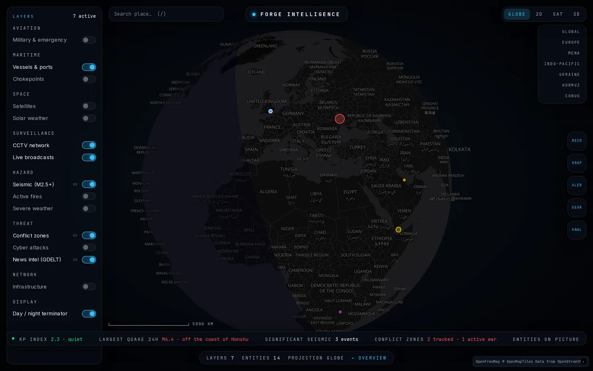
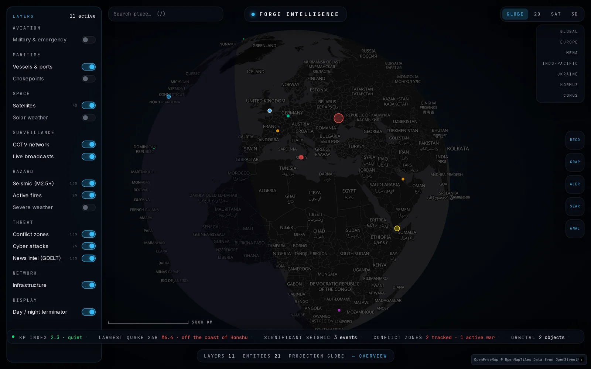
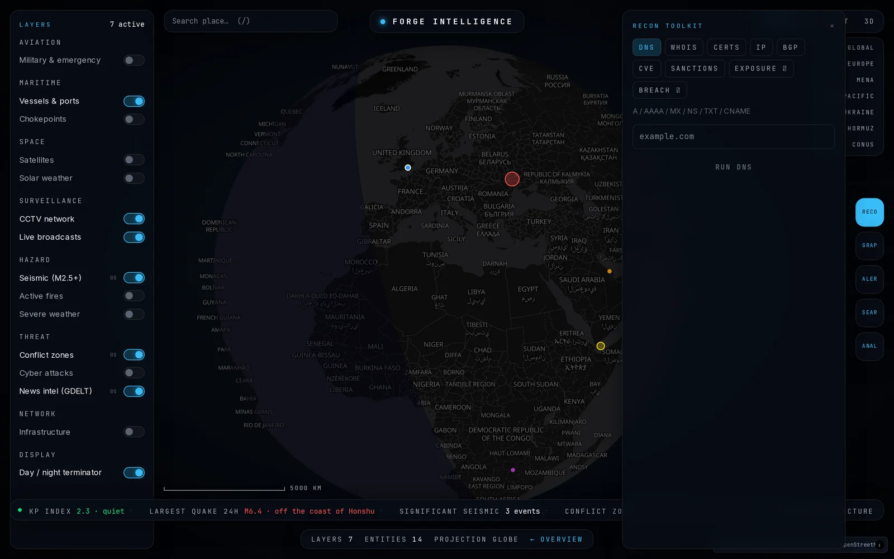

# Forge Intelligence

**Real-time OSINT fusion console.** A WebGL globe over live public-domain
intelligence feeds, a passive-first reconnaissance toolkit, an entity link
graph, and an AI analyst briefed on whatever is currently on screen.

[Live console](https://www.577industries.com/intelligence/app) ·
[Overview](https://www.577industries.com/intelligence) ·
[Data sources](docs/data-sources.md) ·
[Security](docs/security.md)

---

## Run it

No API keys. No accounts. No external services.

\`\`\`bash
docker compose up
# → http://localhost:3000
\`\`\`

or from source:

\`\`\`bash
npm install
npm run dev
# → http://localhost:3000
\`\`\`

Every default layer runs on keyless public-domain feeds — USGS, NASA
FIRMS/EONET, NOAA SWPC, GDACS, CelesTrak, US Treasury OFAC, RDAP. Optional
capabilities (AI analyst, licensed exposure lookups, energy quotes) are listed
in [\`.env.example\`](.env.example) and each one **reports itself unconfigured**
rather than degrading silently.

## What it does

| | |
|---|---|
| **Globe** | MapLibre GL with a day/night terminator, 2D projection, satellite imagery and 3D building footprints |
| **15 layers** | Aviation, maritime, space, surveillance, hazard, threat and network — independently toggled, independently refreshed |
| **Live refresh** | Per-layer cadence from 20 s to 15 m, paused entirely while the tab is hidden |
| **RECON toolkit** | DNS, RDAP/WHOIS, IP intel, BGP, certificate transparency, CVE, OFAC sanctions, host exposure, breach exposure — tiered by legal blast radius |
| **Entity graph** | Pivot from a domain, IP or ASN through related infrastructure |
| **AI analyst** | Assessment of the layers currently on screen, through a configurable model gateway |
| **Region dossier** | Right-click anywhere for a synthesised local picture |

## Two rules this codebase actually enforces

**1. Nothing is fabricated.** When a source is unavailable, the layer says so.
Nothing on this surface invents a reading, because a plausible-looking fake
datum on an intelligence console is worse than a blank one.

We did not always live up to this. On 2026-07-25 we shipped a submarine-cable
layer of 717 routes; an audit the next day found 590 of them were procedurally
generated — corridor templates replicated with random jitter and drawn exactly
like the real ones. It was removed, the marketing claim that quantified it was
corrected, and \`npm run audit:data-sources\` now fails CI if any source lacks a
named origin and a licence. The incident is recorded in
[docs/data-sources.md](docs/data-sources.md) under rejected sources, because a
rule you only state is not a rule.

**2. Every source is licensed for the use we put it to.** 577 Industries is a
commercial entity, so a feed that is free only for non-commercial use is
disqualified regardless of how good the data is.
[docs/data-sources.md](docs/data-sources.md) lists every upstream with its
licence — **and the ones we rejected, with the reason**. That table includes
sources we had already shipped and had to pull.

## Security

An OSINT console is an unusually attractive target: it fetches
attacker-influenced URLs, renders attacker-influenced text, and offers tools
that can be pointed at third parties.

[docs/security.md](docs/security.md) is the threat model. The short version:

- **Two exploitable SSRF flaws in the upstream implementation were found and
  fixed here** — IPv6 literals walking past a string-prefix private-range check,
  and DNS rebinding between validation and fetch. The second is a
  time-of-check/time-of-use bug that cannot be fixed by validating harder; it is
  closed by pinning the validated IP at the socket layer. Both were disclosed to
  the upstream maintainer before publication. 51 unit tests cover the guard.
- **The open tile proxy was closed.** Upstream's \`?url=\` parameter accepted any
  destination. Ours takes a host allowlist.
- **Header spoofing was removed.** Upstream rotated forged \`X-Forwarded-For\`
  and User-Agent values to evade rate limits. This fork identifies itself
  honestly.
- **Aggressive tools are gated** behind an operator, a tight rate limit and an
  audit entry — rather than removed, so the capability survives.
- **Feed text is escaped** at a boundary that is its own module specifically so
  it is unit-testable.

## RECON tiers

Tools are tiered by legal blast radius, not by convenience.

| Tier | Tools | Gate |
|---|---|---|
| **Passive** | DNS, RDAP/WHOIS, IP, BGP, certificate transparency, CVE, OFAC sanctions | Open, rate-limited. These read public registries and send nothing to the subject. |
| **Gated** | Host exposure, breach exposure | Operator + rate limit + audit entry. These expose third-party data and need your own licence for the upstream provider. |
| **Off by default** | Active scanning | Unconfigured, and answers 503. Scanning third-party hosts without written authorisation is unlawful in most jurisdictions. If you enable it, that is your engagement and your liability. |

## Architecture

\`\`\`
Browser (.fi-root, scoped)
  └── /intelligence/app ─ console (client)
        ├── ForgeIntelMap ────── MapLibre globe, map layers, popups
        ├── LayerRail ────────── catalog-driven toggles + freshness
        ├── LazyPanels ───────── analyst · recon · graph · alerts · dossier
        └── fetch/poll ───────── one request per fetch-domain
                │
                ▼
        /api/intelligence/*  (Node runtime)
                ├── KV cache: fresh TTL + stale fallback
                ├── rate limit per bucket
                └── SSRF guard on every user-influenced fetch
                        │
                        ▼
                public-domain upstreams
\`\`\`

**Catalog-driven.** Layers, fetch domains, refresh cadence, visibility and
popups are all tables. Adding a layer is a row, not a code path — the recipe is
in [docs/operations.md](docs/operations.md).

**Polling is cheap by construction.** Sub-toggles sharing an endpoint collapse
onto one timer at the fastest cadence any of them declares; static reference
domains open no timer at all; polling stops entirely while the tab is hidden.

## Configuration

Everything is optional. See [\`.env.example\`](.env.example) for the full list
with the failure mode of each. The ones most people want:

| Variable | Enables | Without it |
|---|---|---|
| \`GOOGLE_GENERATIVE_AI_API_KEY\` | AI analyst | Analyst reports unavailable |
| \`FI_OPERATOR_TOKEN\` | The gated RECON tools | They answer 401 |
| \`REDIS_URL\` | Shared cache + rate limits across replicas | In-process memory |
| \`EIA_API_KEY\` | Energy quotes in the ticker | Ticker carries intelligence data only |

## Documentation

- [docs/data-sources.md](docs/data-sources.md) — every feed, its licence, its commercial status, and the rejected ones
- [docs/security.md](docs/security.md) — threat model, the upstream fixes, blast-radius tiers
- [docs/operations.md](docs/operations.md) — activation paths, cadences, runbook
- [docs/ATTRIBUTION.md](docs/ATTRIBUTION.md) — upstream provenance
- [SECURITY.md](SECURITY.md) — how to report a vulnerability

## Provenance and licence

Forge Intelligence is a hardened fork of the MIT-licensed
[Osiris](https://github.com/simplifaisoul/osiris). That project made this one
possible, and its licence and copyright are retained in full in
[NOTICE](NOTICE) alongside a plain-language summary of what we changed.

577 Industries' own additions are licensed under **Apache-2.0** — see
[LICENSE](LICENSE).

## About this repository

This is a **published mirror** of a subsystem developed inside 577 Industries'
main application. It is generated from that tree, so it is a read-only
distribution rather than a collaborative project: we are not accepting pull
requests, and issues are not monitored for feature requests.

You are welcome to fork it, run it, and build on it — that is what the licence
is for.

**Security reports are the exception** and are genuinely wanted: see
[SECURITY.md](SECURITY.md).

## Maintenance

This repository is exported from the 577i-unified monorepo by its
`scripts/export-forge-intelligence.ts`; it is never edited directly and never
merged back, so dependency updates arrive through the next export rather than
through pull requests here. CI runs install + build on every PR.

---

Built by <a href="https://www.577industries.com">577 Industries</a> ·
Forge Intelligence is one of four frontier technologies alongside Forge Evolve,
Forge QBit and Forge Kinetic.

